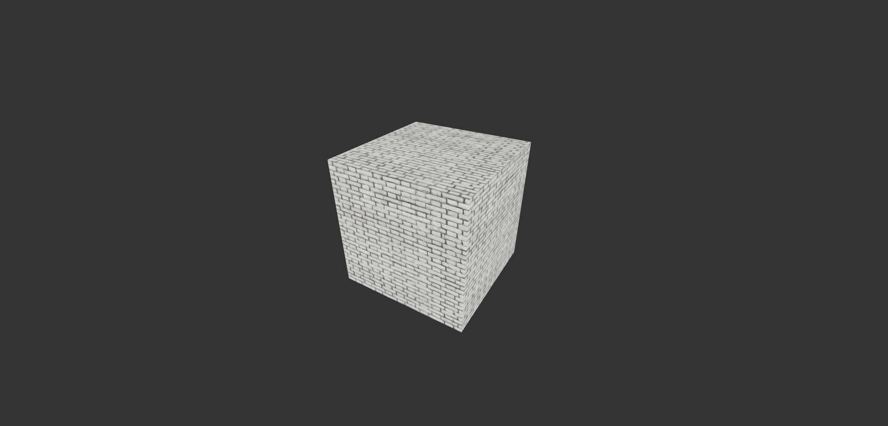

# Three.js Cube Animation

This is a simple Three.js project that creates a rotating cube using WebGL. It serves as a basic template to help you get started with Three.js for 3D graphics in the browser.



## Getting Started

1. To start on local machine:

   ```bash
   npm start
